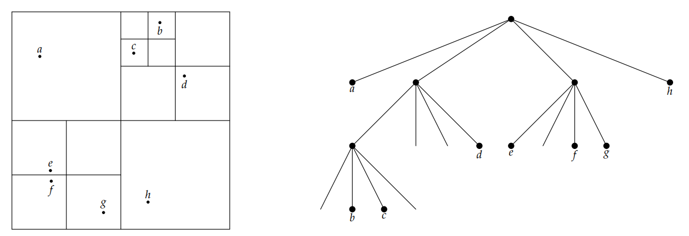

# **Barnes-Hut algorithm**

The barnes Hut algorithm is used to approximate the N-body problem, usually $\mathcal{O}(N^2)$, linearly with the number of bodies i.e. $\mathcal{O}(N)$. Here is implemented for the planar case.

It consists in considering sufficiently distant bodies as a unique body of mass equal to the total mass and position given by the mass center.

In practice each body is inserted in a quad-tree structure: each node of the quad-tree represents a portion of space and carries the mass center position and total mass of that portion. Each node of the quad-tree has $\leq$ 4 children, each representig a quadrant that divides that portion of space. The root of the tree has the total mass of all bodies and global mass center.

In order to insert a body of mass $m$ and coordinates $(x,y)$ one starts from the root and select the appropriate quadrat based on the coordinates of the body (e.g. if $x>0$ and $y>0$ the first quadrant will be the top right (or NE) one). If the quadrant does not contain a body, the body is inserted in it, if it contains a body is divided in another 4 subquadrants and the procedure continue recursively until the old body that was in the quadrant and the new bosy is being inserted are placed in a single quadrant each. Obviously every time a node is subdivided in 4 subquadrants the total mass and mass center position of that node has to be updated.

A group of bodies pointed by node $B$ will belong to a portion of space of radius $s = \displaystyle \frac{s^{\*}}{2^h}$ with $h$ the depth of the ndoe and $s^{\*}$ the global radius.

In order to calculate the force on a body $a$, $\boldsymbol{F}(a)$, one sets a tolerance $\theta$. The force exerted upon $a$ by the group at node $B$ with $d = \textrm{dist}(a,B)$ the distance from a to the mass center of node $B$ is calculated as such:

* If $s/d < \theta$ we consider $B$ distant enough from $a$ to be approximated by its mass center
* Else one proceeds with every subquadrant of $B$ and considers the total force exerted by each subgroup

Having to at worst travel every node the algorithm has a complexity of $\mathcal{O}(N)$.

## **Contents**

* `barnes_static.h`: header file containing the quad-tree struct and the principal functions to build the tree and calculate the static force on each body:

    * `string_to_body` in order to read the bodies data from strings
    * `insert` in order to create the quad-tree recursively in $\mathcal{O}(\textrm{log}N)$
    * `get_mass` in order to get the mass of a body given its coordinates implementing a binary-like search, so $\mathcal{O}(\textrm{log}N)$
    * `get_force` in order to approximate the force on a body in $\mathcal{O}(N)$

* `barnes_static.c`: the actual implementations of the functions with some utilities

* `print_tree.c`: a utility function that prints each level of the tree in order to check if `insert` works properly
