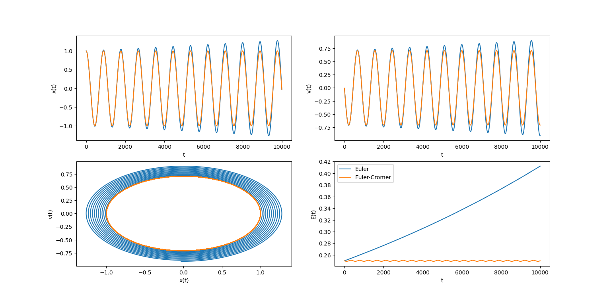
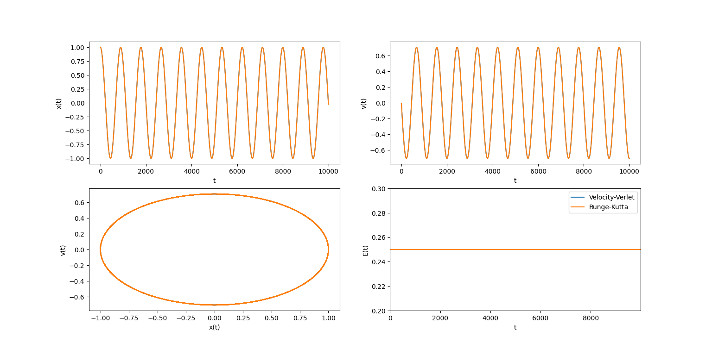
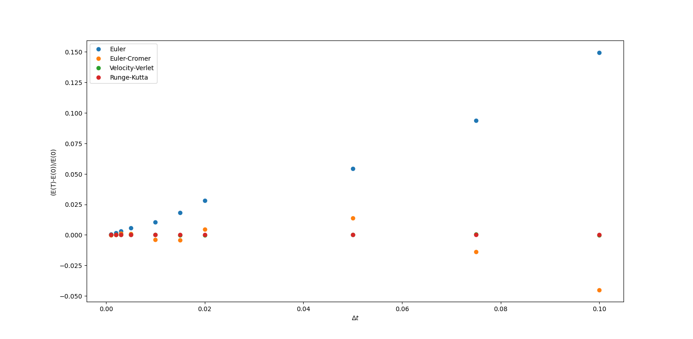

# **Basic integrations algorithms**

The functioning of 4 simple numerical integration algorithms is studied:

1. Euler algorithm
2. Euler-Cromer algorithm
3. Velocity-Verlet algorithm
4. $2^{\circ}$ order Runge-Kutta algorithm

The algorithms are benchmarked on the harmonic oscillator system $$\ddot{x}(t) = -\omega^2x(t)$$ which can be turned into the system 

$$
\begin{cases}
    \dot{v}(t) = \phi(t) \\
    \dot{x}(t) = v(t)
\end{cases}
$$

with $\phi(t) = -\omega^2x(t)$.

The object of study are the stability of the trajectories and energy conservation, as for a fully integrable sysyem the quantity 

$$
E(t) = \frac{1}{2}\dot{x}^2(t) + \frac{1}{2}\omega^2x(t)^2
$$

is conserved, i.e. $\displaystyle\frac{d}{dt}E(t) = 0$.

It will be roported both the energy function $E(t)$ itself and the energy depending on the time step $$\displaystyle\frac{\Delta_{(\Delta t)}E(t)}{E(0)}$$

the latter in order to see the magnitude of the error as time goes.

## **Euler and euler cromer**

They are both first order methods implemented as

### **Euler**

$$
\begin{cases}
v_{n+1} = v_n + \phi_n\Delta t\\
x_{n+1} = x_n + v_n\Delta t
\end{cases}
$$

### **Euler-Cromer**

$$
\begin{cases}
v_{n+1} = v_n + \phi_n\Delta t\\
x_{n+1} = x_n + v_{n+1}\Delta t
\end{cases}
$$

with the difference that Euler-Cromer algorithm is conservative. Indeed this fact is clear in the plots below: Euler's trajectories and energy tends to diverge while Euler-Cromer energy oscillates around a fixed initial value

## **Velocity-verlet and Runge-Kutta**

These are actually usable methods implemented as

### **Velocity Verlet**

$$
\begin{cases}
x_{n+1} = x_n +v_n\Delta t + \frac{1}{2}\phi_n\Delta t^2\\
\\
v_{n+1} = v_n + \displaystyle\frac{\phi_n+\phi_{n+1}}{2}\Delta t
\end{cases}
$$

### **Runge-kutta**

$$
\begin{cases}
\displaystyle x_{n+1} = x_n + (v_n + \frac{1}{2}v^+)\Delta t\\
\\
\displaystyle v_{n+1} = v_n + \phi(x_n + \frac{1}{2}x^+ , v_n + \frac{1}{2}v^+)\Delta t
\end{cases}
$$

with 

$$
\begin{cases}
x^+ \equiv v_n\Delta t\\
v^+ \equiv \phi_n\Delta t
\end{cases}
$$

The results are clearly better of the former two

as the energy is not only conserved but do not oscillates around the initial value.

The validity of VV and RK is clearly visible when the error in function of time is confronted between the four methods: the first 2 are clearly linear methods while the latter have smaller errors 

