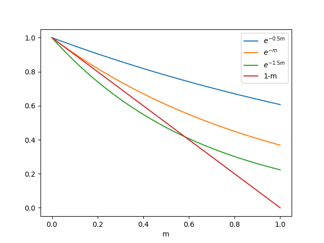
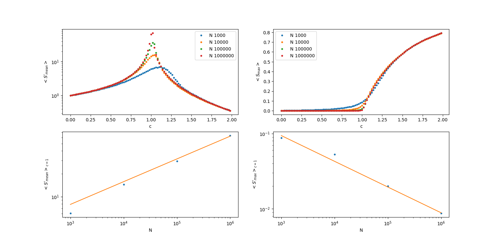

# **Percolation on random graph**

In this project a numerical model of percolation implemented on a random graph is studied. As the concept of percolation is [well defined](https://books.google.it/books/about/Introduction_to_Percolation_Theory.html?id=7TlJk_sUsJ0C&redir_esc=y) [1] in ordinary metric spaces (a connected componet going from a side to the opposite one), with a generic graph a change in the definition is needed (as there is no concept as 'opposite sides' on a graph). 

[Following](https://books.google.it/books/about/Scientific_Programming_C_language_Algori.html?id=4DS7CgAAQBAJ&redir_esc=y) [2] we define percolation on a random graph as the formation of a giant percolating cluster identified as a connected component with the number of nodes of order of magnitude as the total nodes in the graph.

The percolating phenomenon is then described as a dynamical process: starting from a set of N separated nodes at each step a link is added between two random nodes. As the number of steps grows the probability of merging bigger and bigger connected componets grows untill the percolating cluster is formed.

## **Random graphs**

A random graph is a graph generated from a stochastic process, such as adding links between nodes randomly chosen. With fixed N nodes and M edges, the total number of graphs composing the ensemble $\mathcal{G}_{N,M}$ is given by 

$$
\binom{A}{M} = \frac{A!}{M!(A-M)!} \hspace{2cm} A \equiv \frac{N(N-1)}{2}
$$

with A the total number of edges between N nodes.

Considering the limit of infinite volume $N \rightarrow \infty$ simplifies the calculation of observables for the sysyem. In this limit we consider the equivalent ensemble $\mathcal{G}_{N,p}$ of graphs with N fixed nodes and a probability 

$$
p = \frac{2M}{N(N-1)}
$$

of having an edge between two nodes, with the total number of edges not fixed anymore.

The degree of every vertex is a number $\in \{0,\dots,N-1\}$ distributed as 

$$
f_k = \binom{N-1}{k}p^k(1-p)^{N-1-k}
$$

with $f_k$ the probability that a node has degree $k$. Indeed not being vincolated by a fixed amount of total edges, for each node independently the probability of having $k$ nodes equals to the number of ways of choosing the $k$ nodes out of N notal (so the binomial) multiplied by the probability that the $k$ chosen nodes have a link with the node in question and the remaining $N-1-k$ don't (and indeed $\sum_k^{N-1} f_k = 1$).

Now let's consider the case in which the average degree of the graph is fixed in the infinite volume limit:

as in general the average degree for N nodes and M links is $c=\frac{2M}{N}$, in $\mathcal{G}_{N,p}$ we have $p=\frac{c}{N-1}$ and

$$
f_k = \lim_{N\rightarrow\infty}\frac{(N-1)!}{k!(N-1-k)!}\Bigg(\frac{c}{N-1}\Bigg)^k\Bigg(1-\frac{c}{N-1}\Bigg)^{N-1-k} = \frac{c^k}{k!}e^{-c}
$$

i.e. in this limit in a graph of average degree $c$ the probability of having a degree greater than $c$ decreases exponentially as a Poisson distribution.

## **Phase transition on a random graph**

Qualitatively the behaviour of a random graph is easy to picture: for $c<1$ the graph will be a forest composed of mostly isolated nodes and small trees while for $c>1$ the probability of macroscopic connected components to appear will be high.

Indeed we now show that $c$ represents an order parameter for the phase transition from forest to percolating cluster.

Considering a graph with N nodes with $m$ the fraction of nodes belonging to the percolating cluster, $m$ will be different from zero only when the percolating cluster is macroscopic: let's consider adding a new vertex to the graph. This new graph still belongs to $\mathcal{G}_{N,p}$ if each edge between the new node and the old nodes are present with the right probability $p=c/N$. 

In this case the degree of the new vertex is a random variable distributed as a poissonian distribution and the probability that the a vertex belongs to the giant cluster is still $m$ (up to terms $\mathcal{O}(\frac{1}{N})$) even after adding the new vertex and is given by the solution of

$$
1-m = \displaystyle\sum_{k=0}^{\infty}e^{-c}\frac{c^k}{k!}(1-m)^k
$$

which tells that the probability for the new vertex not to belong to the giant cluster $(1-m)$ is equal the sum of the probabilities
that this vertex has k neighbors, $e^{−c}c^k/k!$, none of which belong to the giant cluster, $(1 − m)^k$.

Summing the series we get

$$
1-m=e^{-cm}
$$

which can be solved numerically (and graphically as reported below) or analitically expanding for $m\approx0$



$$
1-m \approx 1-cm+\frac{1}{2}c^2m^2 \rightarrow 

\begin{cases}
    m = 0\\
    m = 2(c-1)/c^2 \approx 2(c-1)
\end{cases}
$$

With $c>1$ another solution beside the trivial one $m=0$ appears, indicating the presence of a giant cluster i.e. for $c=c_p=1$ critical value the $\mathcal{G}_{N,p}$ undergoes a phase transition from forest to percolating.

### **Observables in the phase transition**

In order to identify and study a phase transition one needs observables that change abruptly (in a continuous way or not depending on the type of transition) with the order parameter, in this case $c$.

1. **Average size of the connected components**

    As first observable we define the average size of the connected components

    $$
    \bar{S} \equiv \frac{1}{N}\displaystyle \sum_{i=1}^NS_i = \frac{1}{N}\displaystyle\sum_{C}S_{C}^2
    $$

    with $S_i$ the size of the connected compent node $i$ belongs to. $\bar{S}$ can be expressed also in term of the sum of square of the size of the connected componets $S_C$ grouping togheter all the vertices belonging to the same cluster.

    Due to the fact that for $c>1$ the average size will be dominated by the biggest cluster, we actually use the average size excluding the biggest connected component from the summation

    $$
    \bar{S}' \equiv \frac{1}{N} \displaystyle \sum_{C'}S_C^2
    $$ 

    Let's show that the ensemble average of this quantity diverges as $c\rightarrow1$:

    after two clusters of sizes $S_1$ and $S_2$ merges the difference in the average size is $\Delta\bar{S}' = 2S_1S_2/N$ as before the merging their contribution to the summation for $\bar{S}'$ is $S_1^2 + S_2^2$ while after the merging is $(S_1+S_2)^2$. After the merge also the average degree of the graph changes as $\Delta c = 2/N$. Taking the ensemble average then we have the differential equation

    $$
    \Big\langle\frac{\Delta\bar{S}'}{\Delta c}\Big\rangle \approx \dot{\langle\bar{S}'\rangle} = \langle\bar{S}\rangle^2
    $$

    which is solved as 
    $$
    \langle\bar{S}\rangle = \frac{1}{1-c}
    $$

2. **Maximum cluster size**

    As first observable we choose the size of the largest cluster by size of the graph, i.e.

    $$
    \frac{\langle S_{\textrm{max}}\rangle}{N}
    $$

    which we expect to be 0 for $c<1$ and tending towards 1 for  $c>1.$


## **Numerical study**

Implementing the system in the ```perc_rand_graph.c``` program some numerical symulation with different graph sizes have been done. In particular the graph was evolved for 100 values of $c$ in the range $[0,2]$ producing 1000 different trajectories to be averaged in order to obtain the ensemble average (as a normal montecarlo simulation), all of this for $N=10^3, 10^4, 10^5, 10^6$. The results are reported below



The values $\langle\bar{S}'\rangle_{c=1}$ and $\langle S_{\textrm{max}}\rangle_{c=1}$ have been fitted as a function of the size N obtaining 

$$
\langle\bar{S}'\rangle_{c=1} \propto N^{\alpha}\\
\ \\
\frac{\langle S_{\textrm{max}}\rangle_{c=1}}{N} \propto N^{-\beta} \rightarrow \langle S_{\textrm{max}}\rangle_{c=1} \propto N^{\beta}
$$

with 

$$
\begin{cases}
\alpha = 0.32\\
\beta = 0.34
\end{cases}
$$

compatible with the theoretical value $\displaystyle\frac{1}{3}$ for both the exponets.

## **Contents**

* **data**: contains the raw data produced by the algorithm for different graph sizes. the data is organized as a series of different trajectories separated by a ```\n``` character. For each trajectory we have the value of $c$ and the 2 observables.

* ```perc_rand_graph.c``` the algorithm itself. It can be executed as it is and produce a file containing the data.

* ```plot.py``` a script to extract the ensemble means from the raw data and produce the plot reported above.


## **References**

[1] [Introduction to Percolation Theory](https://books.google.it/books/about/Introduction_to_Percolation_Theory.html?id=7TlJk_sUsJ0C&redir_esc=y) - Dietrich Stauffer, Amnon Aharony

[2] [Scientific Programming: C-language, Algorithms And Models In Science](https://books.google.it/books/about/Scientific_Programming_C_language_Algori.html?id=4DS7CgAAQBAJ&redir_esc=y) - Enzo Marinari, Luciano Maria Barone, Giovanni Organtini, Federico Ricci-tersenghi

